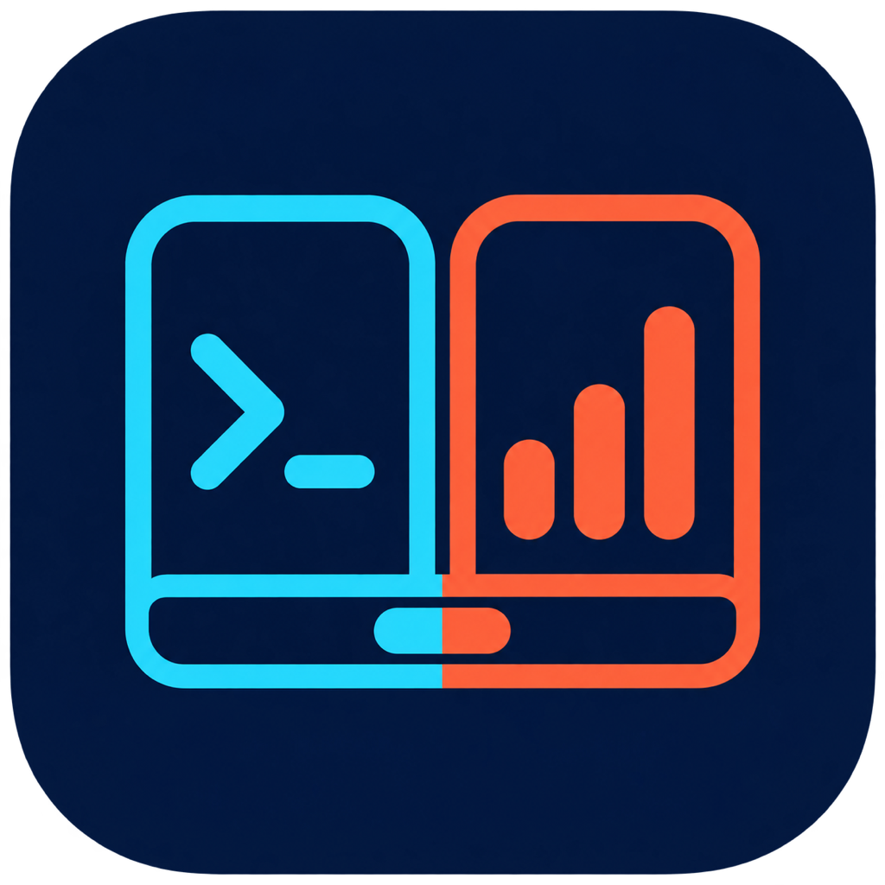
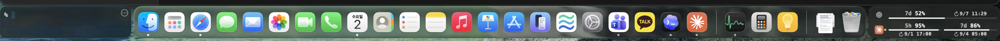
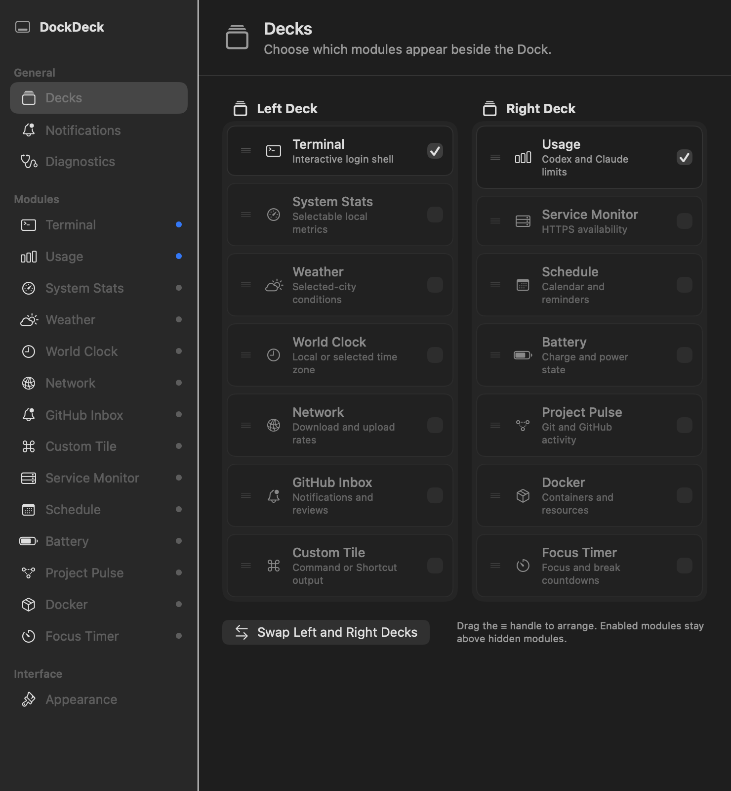

<p align="center">
  
</p>

<h1 align="center">DockDeck</h1>

<p align="center">
  A terminal and compact developer module deck that lives beside your macOS Dock.
</p>

<p align="center">
  <a href="assets/dockdeck-overview.png">
    
  </a>
</p>

<p align="center">
  <sub>Compact terminal and configurable Codex and Claude usage beside the macOS Dock. Open the image for full resolution.</sub>
</p>

DockDeck uses the space beside a bottom-aligned Dock for up to two compact module Decks. Assign Terminal, Usage, System Stats, Service Monitor, Weather, Schedule, World Clock, Battery, Network, Project Pulse, GitHub Inbox, Docker, Custom Tile, and Focus Timer to either side; each non-empty Deck shows one enabled module at a time. The terminal stays interactive whenever it is selected. Both Decks follow the Dock across displays, Spaces, and auto-hide transitions.

## Features

- Persistent [SwiftTerm](https://github.com/migueldeicaza/SwiftTerm) login shell with a compact `% ` prompt that does not change user shell files.
- Remaining or used Codex and Claude capacity, reset times, and an optional even-use pace marker from their supported local CLIs. Claude can refresh automatically or use only its optional status-line bridge; neither mode reads browser cookies or private web endpoints.
- Two to four selectable local CPU, memory, disk, network-I/O, and temperature tiles with a configurable 1–10 second sampling interval and in-memory trend lines.
- HTTPS service availability and latency checks for up to four user-configured endpoints, including recent response-time trends.
- Current temperature, daily high and low, and conditions for a user-selected city.
- Current or next macOS Calendar event plus optional due Reminders, with separate explicit permissions and source selection.
- Local or selected-world-time display with system, 12-hour, and 24-hour formats.
- Internal battery level, power state, and the system-provided charge or discharge estimate.
- Local download and upload throughput for the current primary network interface.
- Local Git status, one remote GitHub repository, or the signed-in user's 7-day GitHub contribution summary through the installed `gh` CLI.
- Account-wide GitHub notifications, mentions, review requests, and optional recent Actions failures through the installed `gh` CLI.
- Local Docker container counts, health, CPU, and memory through the installed Docker CLI.
- Bounded text or JSON output from a trusted executable or macOS Shortcut.
- Persistent focus and break countdowns that continue behind other modules and survive an app restart.
- Opt-in native notifications for quota thresholds, service transitions, low battery, and completed focus timers.
- Dock-aware, symmetric placement across displays, Spaces, and auto-hide transitions.
- Animated manual module selection per Deck; scroll to switch, double-click a read-only panel for a resizable detail window, or right-click for navigation and settings. Reduce Motion is respected.
- A shared sectioned Settings sidebar with Deck cards, module detail pages, side placement, and independent module visibility controls.
- On-demand Diagnostics for local CLI sign-in, Accessibility, the optional temperature reader, and network availability.
- Disabled modules stop their background work; selected samplers use a coarser cadence while hidden, and all module timers slow in macOS Low Power Mode.
- Click-to-focus terminal expansion, forgiving edge resizing, and remembered dimensions.
- Native Liquid Glass on macOS 26, with a translucent fallback and stronger terminal tint on earlier macOS.
- Manual large-terminal mode plus 20 themes with configurable fonts, tint, corner radius, and panel placement.

## Modules

| Module | Summary | Guide |
| --- | --- | --- |
| Terminal | Persistent login shell with compact, focused, and large modes | [Terminal](docs/modules/terminal.md) |
| Usage | Codex and Claude capacity, reset times, and data freshness | [Usage](docs/modules/usage.md) |
| System Stats | CPU, memory, disk, network I/O, and temperature | [System Stats](docs/modules/system-stats.md) |
| Service Monitor | Availability and latency for configured endpoints | [Module catalog](docs/modules/catalog.md#service-monitor) |
| Weather | Current conditions for a selected city | [Module catalog](docs/modules/catalog.md#weather) |
| Schedule | Current Calendar event or next event/Reminder | [Schedule](docs/modules/schedule.md) |
| World Clock | Local or selected time zone | [Module catalog](docs/modules/catalog.md#world-clock) |
| Battery | Charge, power state, and time estimate | [Module catalog](docs/modules/catalog.md#battery) |
| Network | Primary-interface download and upload throughput | [Module catalog](docs/modules/catalog.md#network) |
| Project Pulse | Local Git, one GitHub repository, or personal GitHub contribution activity | [Project Pulse](docs/modules/project-pulse.md) |
| GitHub Inbox | Notifications, mentions, reviews, and optional Actions failures | [GitHub Inbox](docs/modules/github-inbox.md) |
| Docker | Local container state and aggregate resource use | [Module catalog](docs/modules/catalog.md#docker) |
| Custom Tile | Bounded output from a trusted executable or macOS Shortcut | [Custom Tile](docs/modules/custom-tile.md) |
| Focus Timer | Persistent focus and break countdowns | [Module catalog](docs/modules/catalog.md#focus-timer) |

## Decks and settings

Settings are organized into **General**, **Modules**, and **Interface** sections. Module pages are generated from the same registry that drives the Deck editor, with enabled modules listed first. Drag a card from its `≡` handle within a Deck to set its cycle order or into the other Deck to change sides. Cards preview their destination and animate into place while dragging; macOS Reduce Motion is respected. The same moves are available from each card's context menu. Move every card to one Deck if you want the other side completely empty and hidden. You can also swap the complete left and right Decks. At least one module remains enabled so Settings stays reachable. DockDeck remembers each Deck's selected module and the last Settings page you opened. Scroll over a compact Deck to cycle its modules; a transient page indicator shows the new position.

<p align="center">
  <a href="assets/dockdeck-decks-settings.png">
    
  </a>
</p>

<p align="center">
  <sub>Modules can be ordered on either side. An empty Deck remains a drop target in Settings and is hidden beside the Dock.</sub>
</p>

## Documentation

- [Terminal controls and shortcuts](docs/modules/terminal.md)
- [Usage values, reset times, and provider states](docs/modules/usage.md)
- [System Stats metrics and macOS memory semantics](docs/modules/system-stats.md)
- [Schedule and Reminders](docs/modules/schedule.md)
- [Project Pulse](docs/modules/project-pulse.md)
- [GitHub Inbox](docs/modules/github-inbox.md)
- [Custom Tile](docs/modules/custom-tile.md)
- [Service Monitor, Weather, World Clock, Battery, Network, Docker, and Focus Timer](docs/modules/catalog.md)
- [Local notifications](docs/notifications.md)
- [Diagnostics](docs/diagnostics.md)
- [Claude Code monitoring modes, bridge setup, and troubleshooting](docs/integrations/claude-code.md)

## Requirements

- macOS 13 or later
- Accessibility permission for Dock geometry tracking
- [Codex CLI](https://github.com/openai/codex) signed in locally for Codex usage data
- A current [Claude Code](https://code.claude.com/docs/en/installation) release signed in locally for Claude usage data; the status-line bridge is optional
- [GitHub CLI](https://cli.github.com/) signed in locally for GitHub modules (optional)
- A running local Docker engine and Docker CLI for the Docker module (optional)
- Swift 5.9 or later when building from source

Without Accessibility permission, DockDeck remains usable in fixed fallback positions. Only a bottom-aligned Dock is tracked precisely; side-aligned Docks use the fallback layout.

## Run from source

```bash
git clone https://github.com/bangwol/DockDeck.git
cd DockDeck
swift test
swift run DockDeck
```

Enable Dock geometry diagnostics when needed:

```bash
DOCKDECK_DEBUG=1 swift run DockDeck
```

## Start at login

```bash
./scripts/install.sh
```

The installer builds and signs `~/Applications/DockDeck.app`, registers a per-user LaunchAgent, starts DockDeck immediately, and starts it at future logins. The stable app path and signing identity allow Accessibility approval to survive rebuilds. It prefers the sole Apple Development identity in the login Keychain. No certificate name or account information is written to the repository.

If there is no single Apple Development identity, the installer creates a self-signed local fallback. macOS may request Accessibility approval again after rebuilding with that fallback. Select a different installed identity when needed:

```bash
DOCKDECK_SIGNING_IDENTITY="certificate name or SHA-1 hash" ./scripts/install.sh
```

Review the script before running it. To remove the LaunchAgent:

```bash
./scripts/uninstall.sh
```

The uninstall script removes the login item only. It leaves the installed app, local signing certificate, and build output in place.

## Build a distributable local bundle

```bash
./scripts/package.sh
```

This produces a universal, ad-hoc signed `DockDeck.app`, a versioned ZIP such as `DockDeck-0.1.0-macos-universal-unsigned.zip`, and its SHA-256 file without changing login items or the Keychain. Use these artifacts for local QA. Test the ZIP in a fresh macOS account or another Mac so its ad-hoc Accessibility identity does not conflict with the source-installed app.

Public binary distribution requires [Developer ID signing](https://developer.apple.com/support/developer-id/) and [notarization](https://developer.apple.com/documentation/security/notarizing-macos-software-before-distribution). A signing identity can be selected for a release candidate, but the result must still be notarized before publication:

```bash
DOCKDECK_SIGNING_IDENTITY="Developer ID Application: Example" ./scripts/package.sh
```

## Preview distribution

DockDeck does not yet publish a Developer ID-signed and notarized stable binary. Until that is available, installing from source with `./scripts/install.sh` is the recommended preview path.

Tagged GitHub preview releases may include an explicitly labeled `unsigned` ZIP for technical evaluation. Manually dispatched preview builds appear as GitHub Actions artifacts and expire after 14 days; they are not GitHub Releases. Both are ad-hoc signed, so macOS requires manual approval in **System Settings → Privacy & Security → Open Anyway**, and an update may require Accessibility approval again. Preview artifacts built by GitHub Actions include a SHA-256 file and build-provenance attestation:

```bash
gh attestation verify DockDeck-*-unsigned.zip -R bangwol/DockDeck
```

## Usage data and privacy

DockDeck does not read browser cookies, browser credential stores, or private web endpoints. It observes only mouse-down occurrence to collapse the focused terminal; it does not record global keystrokes, pointer coordinates, or clicked content.

| Provider | Source | Local behavior |
| --- | --- | --- |
| Codex | `codex app-server` using `account/rateLimits/read` | Runs the locally installed official Codex CLI as a long-lived subprocess |
| Claude | Official Claude Code `/usage`; optional status-line JSON | In Automatic mode, briefly launches the signed-in local CLI in safe mode, captures bounded usage text in memory, then exits. Status Line Only stores only `rate_limits` and an observation timestamp in a local cache. DockDeck never reads Claude OAuth credentials. |
| System Stats | macOS host, file-system, routing, and `ProcessInfo` APIs; optional validated local Stats SMC tool | Samples only selected CPU, memory, disk, network-counter, and temperature values locally; recent trends stay in memory for at most 15 minutes |
| Service Monitor | User-configured HTTPS or local HTTP URLs | Sends cookie-free `HEAD` requests; rejects common URL credential fields before local storage; recent latency stays in memory for at most 15 minutes |
| Weather | Open-Meteo forecast and geocoding APIs | Sends submitted searches and selected coordinates over HTTPS only while used; stores the selected city locally |
| Schedule | Apple EventKit | Reads selected calendars and optional due Reminders into memory after separate explicit permissions; never saves, edits, logs, or uploads items |
| World Clock | macOS time-zone database | Formats time locally and stops its minute timer while disabled |
| Battery | macOS IOKit | Reads the internal power source locally; does not read battery identifiers or serial numbers |
| Network | macOS routing and configuration APIs | Reads only primary-interface byte counters; does not inspect network traffic or destinations |
| Project Pulse | Local `git`; authenticated `gh` REST, GraphQL, and optional Actions calls | Stores a selected local path, GitHub view, or `owner/repository` name. Personal contribution totals stay in memory; command output and GitHub tokens are never stored. |
| GitHub Inbox | Authenticated `gh` notifications and optional Actions calls | Stores only an optional `owner/repository` name. Counts and command output stay in memory; authentication remains owned by GitHub CLI. |
| Docker | Local Docker CLI and engine socket | Runs read-only `ps` and `stats` commands. Container output stays in memory and Docker credentials are not read by DockDeck. |
| Custom Tile | User-selected executable or macOS Shortcut | Stores its path, arguments, or Shortcut name. Output stays in memory. The trusted source runs with the user's permissions under strict time and output limits. |
| Focus Timer | Local countdown state | Stores phase, deadline, and remaining duration only when timer state changes |
| Notifications | macOS UserNotifications | Evaluates enabled rules locally and sends no notification data to an external service |

Storage locations and permission details are documented in the
[Usage](docs/modules/usage.md#local-files-and-process-boundaries) and
[Terminal](docs/modules/terminal.md#settings-and-local-files) guides.

## Security

Report suspected vulnerabilities through [GitHub private vulnerability reporting](https://github.com/bangwol/DockDeck/security/advisories/new), not a public issue. See [SECURITY.md](SECURITY.md) for the supported channels and reporting details.

## Project lineage

DockDeck began as a derivative of [Starboard v0.17.1](https://github.com/palamim/starboard/tree/v0.17.1) by Leonardo Palamim Cardozo. It is independently maintained and is not affiliated with or endorsed by the original project.

Starboard's MIT copyright and permission notice remain in [LICENSE](LICENSE). Dependency notices are recorded in [THIRD_PARTY_NOTICES.md](THIRD_PARTY_NOTICES.md) and [ThirdPartyLicenses](ThirdPartyLicenses).

OpenAI and Claude marks identify their respective usage providers only. DockDeck is not affiliated with or endorsed by OpenAI or Anthropic. The marks remain the property of their respective owners and are not covered by DockDeck's MIT license; provenance is recorded in [THIRD_PARTY_NOTICES.md](THIRD_PARTY_NOTICES.md).

## License

DockDeck is distributed under the [MIT License](LICENSE).
